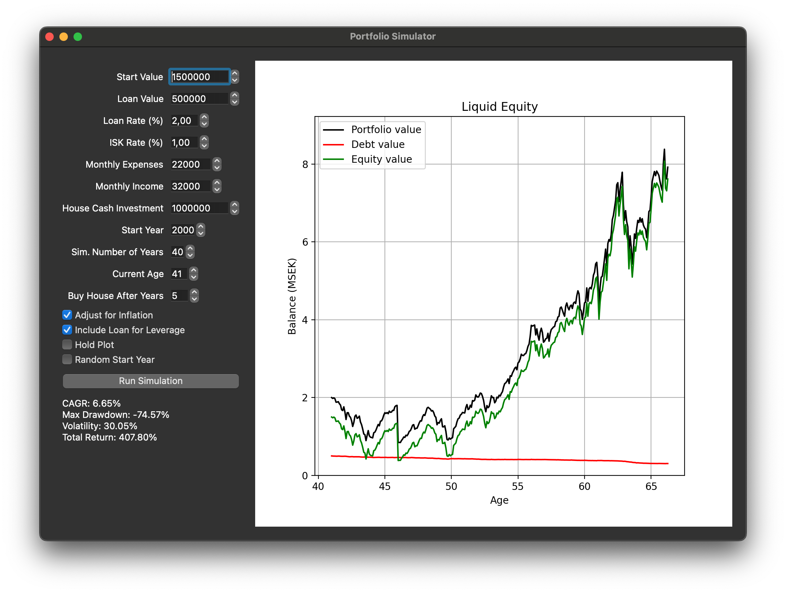

# Portfolio Simulator GUI

A simple graphical tool for simulating and visualizing a long-term investment portfolio consisting of a single asset. 
This is a quick hack I wrote while trying out Github Copilot. Not being an economist, please excuse the misuse of any terms.
It downloads historical fund (Avanza) and Swedish inflation (SCB) data, and performs a backtracking simulation based on a scenario that you specify.
The scenario can include leverage, a house purchase, and the effect of inflation. 
It's hard-coded to download data for the fund "SEB Sverigefond", which is pretty close to the Swedish stock market index OMX Stockholm 30 GI, but you can change that pretty easily.  

## Features

- **Interactive GUI** built with PySide6 (Qt for Python)
- **Parameter controls** for start value, loan, rates, costs, salary, house investment, simulation years, and more
- **Random start year** and "hold plot" for scenario overlays
- **Plot fund price** and **inflation** directly from the GUI
- **Simulation results** plotted as Portfolio, Debt, and Equity over time
- **Performance metrics** (CAGR, Max Drawdown, Volatility, Total Return) shown after each simulation

## Requirements

Install dependencies with:

```bash
pip install -r requirements.txt
```

## Usage

Run the GUI with:

```bash
python portfolio_gui_qt.py
```

## Parameters

- **Start Value**: Initial portfolio value (SEK)
- **Loan Value**: Initial loan amount (SEK)
- **Loan Rate (%)**: Annual loan interest rate
- **ISK Rate (%)**: Annual ISK tax rate
- **Monthly Expenses**: Monthly expenses (SEK)
- **Monthly Salary**: Monthly income (SEK)
- **House Cash Investment**: Amount spent on house purchase (SEK)
- **Start Year**: Year to start the simulation
- **Sim. Number of Years**: Number of years to simulate
- **Current Age**: Your current age (for x-axis)
- **Buy House After Years**: When to buy a house (years after start)
- **Simulate Inflation**: Toggle inflation effect
- **Include Loan for Leverage**: Toggle leverage
- **Hold plot**: Overlay multiple runs
- **Random Start Year**: Use a random start year

## Buttons

- **Run Simulation**: Runs the simulation and updates the plot and metrics
- **Plot fund price**: Shows the historical fund price
- **Plot inflation**: Shows the historical inflation rate

## Notes

- Data is fetched from Avanza and SCB APIs.
- The simulation logic is in `portfolioSimulator.py`.

## Screenshot

 

---

**License:** MIT